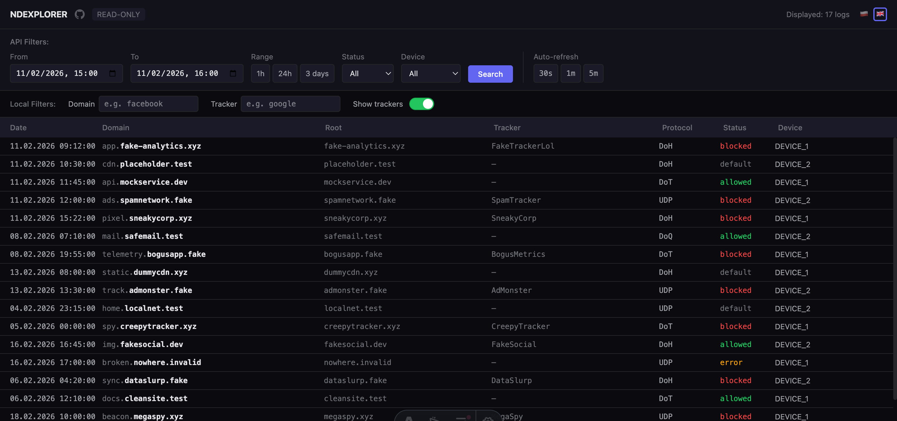
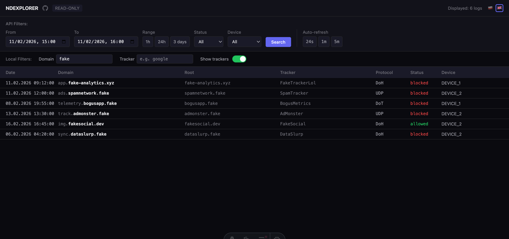

<p align="center">
  <h1 align="center">NDEXPLORER</h1>
  <p align="center">
    Fast, read-only NextDNS log explorer.<br>
    Runs locally on <code>localhost:4321</code>. Bilingual interface (PL / EN).
  </p>
  <p align="center">
    <a href="https://github.com/maciejaszex/ndexplorer"></a>
    
    
    
  </p>
</p>

---

## Screenshots





## Why?

The NextDNS dashboard doesn't offer flexible log filtering. NDExplorer gives you a compact, fast interface with:

- Client-side filtering by domain and tracker name
- Infinite scroll pagination
- Auto-refresh (30s / 1m / 5m)
- Device-based log browsing
- Date range presets (1h, 24h, 3 days)

All read-only — nothing is modified in your NextDNS settings.

## Requirements

- **Node.js** 24+ (see `.nvmrc`)
- **NextDNS API key** — [get it here](https://my.nextdns.io/account)
- **NextDNS profile ID** — visible in your dashboard URL (e.g. `abc123` from `https://my.nextdns.io/abc123/...`)

## Quick start

```bash
git clone https://github.com/maciejaszex/ndexplorer.git
cd ndexplorer
cp .env.example .env    # fill in your API key and profile ID
npm install
npm run dev             # open http://localhost:4321
```

## Environment variables

| Variable | Description | Default |
|---|---|---|
| `NEXTDNS_API_KEY` | Your NextDNS API key | *(required)* |
| `NEXTDNS_PROFILE_ID` | Your NextDNS profile ID | *(required)* |
| `NEXTDNS_LOGS_LIMIT` | Logs per API request (10–1000) | `200` |

## Scripts

| Command | Description |
|---|---|
| `npm run dev` | Start dev server (`localhost:4321`) |
| `npm run build` | Production build |
| `npm run preview` | Preview production build |
| `npm run lint` | Run ESLint |
| `npm run lint:fix` | Run ESLint with auto-fix |
| `npm test` | Run tests (Vitest) |
| `npm run test:watch` | Run tests in watch mode |
| `npm run secrets` | Scan for leaked secrets ([Secretlint](https://github.com/secretlint/secretlint)) |
| `npm run kill` | Kill process on port 4321 |

## Tech stack

| | |
|---|---|
| Framework | [Astro](https://astro.build/) 5.x (SSR) |
| Styling | [Tailwind CSS](https://tailwindcss.com/) 4.x (dark mode) |
| Client logic | Vanilla JS |
| Linting | [ESLint](https://eslint.org/) 9 + typescript-eslint |
| Testing | [Vitest](https://vitest.dev/) 4.x + happy-dom |
| Secret scanning | [Secretlint](https://github.com/secretlint/secretlint) 11.x |
| Git hooks | [Husky](https://typicode.github.io/husky/) 9.x |

## Tests

23 tests across 3 files using Vitest + happy-dom. A **pre-commit hook** runs `lint`, `test` and `secrets` in parallel before every commit.

See [`tests/README.md`](tests/README.md) for strategy, structure and mock data approach.

## License

[MIT](LICENSE) — use freely, but please keep the copyright notice and link back to [this repository](https://github.com/maciejaszex/ndexplorer).
